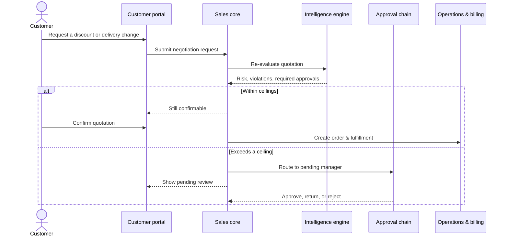
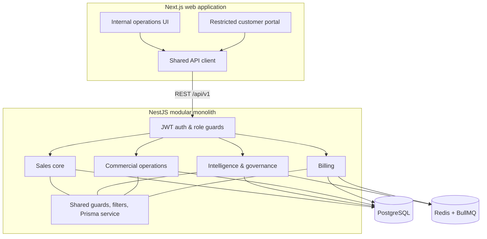
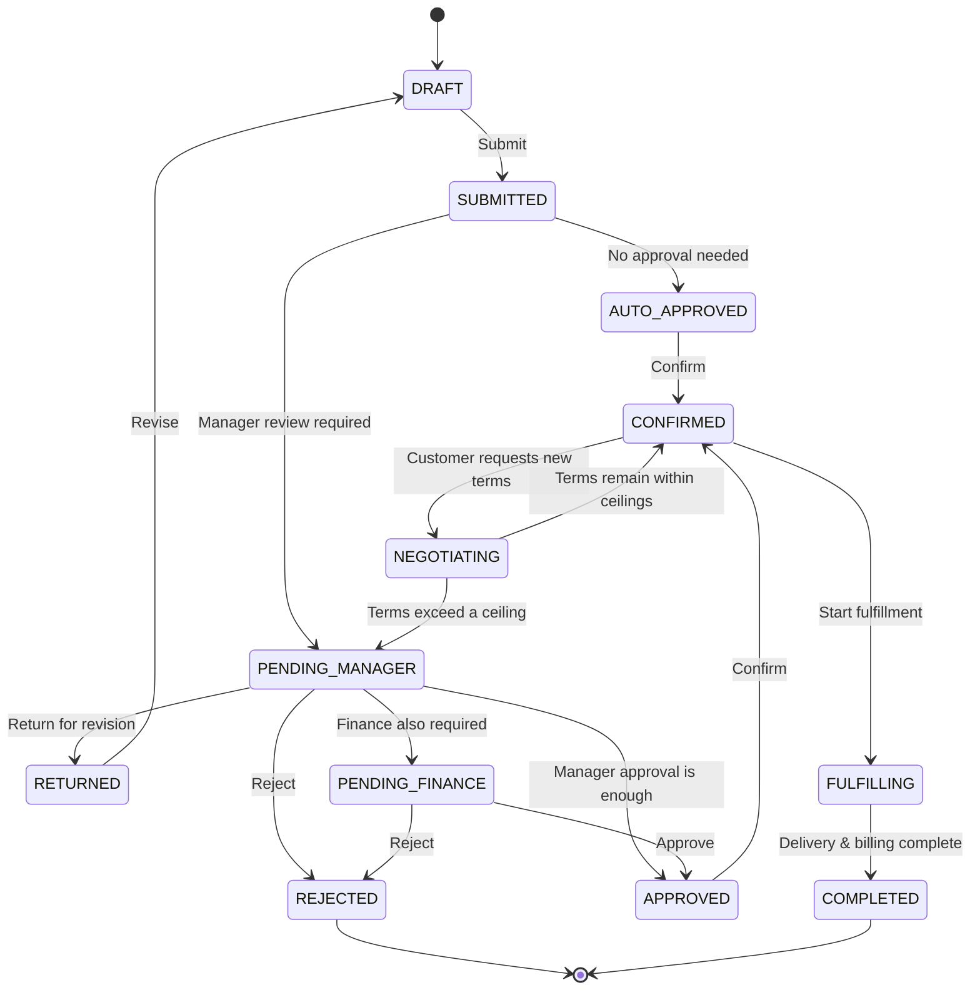

# DealFlow360

**A B2B deal doesn't end when someone clicks "Accept." It just changes shape.**

DealFlow360 carries a single deal through every shape it takes — quotation, discount check, approval, order, warehouse split, fulfillment, invoice, subscription, payment, and ongoing health monitoring — as one governed, auditable pipeline. Not fifteen screens that happen to share a login page. One workflow, wearing fifteen faces.

> Built for an Odoo hackathon, with a rule we didn't break once things got busy: **the backend owns every decision, the frontend just explains it.** No risk score, approval, allocation, or invoice total is ever computed in the browser.

```
Quote → Discount check → Risk score → Approval chain → Order
      → Warehouse split → Fulfillment → Invoice / Subscription
      → Payment → Deal-health watch
```

---

## Table of contents

- [Why this exists](#why-this-exists)
- [A deal, start to finish](#a-deal-start-to-finish)
- [Quickstart](#quickstart)
- [Demo accounts](#demo-accounts)
- [Architecture](#architecture)
- [Tech stack](#tech-stack)
- [Repository layout](#repository-layout)
- [The rules that don't bend](#the-rules-that-dont-bend)
- [Quotation state machine](#quotation-state-machine)
- [Pages](#pages)
- [Customer portal](#customer-portal)
- [API contract](#api-contract)
- [Testing](#testing)
- [Team workflow](#team-workflow)
- [Known limitations](#known-limitations)

---

## Why this exists

Most sales-ops demos fake the hard part. The dashboard looks great, the numbers are hand-picked, and the moment you click something the script didn't anticipate, it falls apart.

DealFlow360's guiding principle is the opposite bet: **a plain screen backed by correct math, real permissions, and a real audit trail beats a beautiful screen that's just acting.** Every discount ceiling, every risk score, every warehouse split, every invoice — computed once, on the server, from data you can inspect.

## A deal, start to finish

Acme Corp wants two laptops, an onsite setup, and an extended warranty.

1. A rep drafts quotation `Q-1042`.
2. The laptop discount (12%) clears its 15% ceiling. The setup-service discount (18%) blows past its 10% ceiling — the UI flags it `OVER (+8 pt)` using numbers the backend already computed.
3. The engine blends every line into one risk score. This one comes back high.
4. The quote routes to the sales manager, then finance. Every step — approve, reject, return, edit — lands in an append-only audit log.
5. Approved and confirmed, the quotation becomes an order.
6. The system recommends a warehouse split, reserves stock, and tracks fulfillment.
7. Shipped hardware gets invoiced. The warranty becomes a subscription. Nothing is billed before it ships.
8. Payment is recorded. Deal Health keeps watching for stalls and anomalies.

If Acme comes back later through the customer portal asking for different terms, the same engine re-evaluates the deal. Stay inside the ceilings and the quote is still confirmable — cross one, and it quietly re-enters approval instead of silently going through.



## Quickstart

You need Docker (for Postgres + Redis), Node, and `pnpm`.

```bash
git clone https://github.com/RushilParikh06/DealFlow360.git
cd DealFlow360
pnpm install
pnpm go
```

`pnpm go` is the whole thing. It will:

1. create `.env` from `.env.example` if you don't have one,
2. detect whichever port Postgres actually came up on and fix `DATABASE_URL` if it disagrees,
3. generate the Prisma client and apply migrations,
4. seed the database — but only if it's empty,
5. start the API and the web app, wait for both to be ready,
6. run risk evaluation on the seeded quotes and a deal-health sweep,
7. print exactly what it did and which accounts you can sign in with.

It won't start a second copy on top of one already running, and if something's genuinely missing (Docker not running, a port already taken by something else), it tells you the command to fix it instead of dying three layers deep inside Prisma.

- Web app: **http://localhost:3000**
- API: **http://localhost:3001/api/v1**

### Prefer to run it step by step?

```bash
cp .env.example .env
docker compose up -d      # Postgres + Redis
pnpm generate              # Prisma client
pnpm db:migrate             # apply migrations
pnpm db:seed                # catalog, policies, quotes, orders, billing
pnpm dev                    # API on :3001, web on :3000
pnpm db:demo                 # with the API running: evaluate quotes, sweep deal health
```

Want to rewind to a known-good demo state at any point?

```bash
pnpm db:reset   # db:seed + db:demo — resets quotes and demo signups, keeps anything an order was cut from
```

Pointing the web app at a different API host? Set `NEXT_PUBLIC_API_URL`.

## Demo accounts

Every seeded account shares one password: **`dealflow123`**.

| Account | Role | Lands on |
|---|---|---|
| `admin@dealflow.test` | Admin | Internal workspace |
| `manager@dealflow.test` | Sales Manager | Internal workspace |
| `rep@dealflow.test` | Sales Rep | Internal workspace |
| `finance@dealflow.test` | Finance | Internal workspace |
| `ops@dealflow.test` | Operations | Internal workspace |
| `buyer@meridian.test` | Customer (Meridian Logistics) | Customer portal |

The role toggle on the login screen is cosmetic — routing is decided by the account's actual role on the server, every time, regardless of which toggle position you leave it on.

Want the guided tour? [`DEMO.md`](./DEMO.md) walks the whole pipeline end to end, from submitting a quote to a customer signing it in the portal.

## Architecture

A modular monolith on purpose: one backend, one database, hard module boundaries enforced by convention instead of network hops. You get the ownership clarity of separate services without paying for separate services to debug.



## Tech stack

| Layer | Choice |
|---|---|
| Frontend | Next.js, TypeScript, Tailwind CSS, shadcn/ui, TanStack Query |
| Backend | NestJS, TypeScript, REST |
| Validation | Zod + `class-validator` |
| Database | PostgreSQL, Prisma (multi-file schema) |
| Background work | Redis + BullMQ |
| Auth | JWT access + refresh tokens, role guards |
| Testing | Jest, Supertest, Playwright |
| Local infra | Docker Compose |

One ORM, one query layer, one UI kit, one deployable backend — on purpose. Adding a new runtime dependency is a conversation, not a `pnpm add`.

## Repository layout

```
apps/
  api/
    src/modules/
      sales/          # quotations, orders, the state machine
      intelligence/   # discount rules, risk, approvals, audit, deal health
      operations/      # catalog, inventory, fulfillment
      billing/          # invoices, subscriptions, payments
      shared/            # cross-cutting infrastructure
  web/                     # all fifteen screens, internal + portal shells
packages/
  contracts/                # shared DTOs, enums, error codes
prisma/
  schema/                    # one schema file per domain
  seed/                        # base data, catalog, policies, demo quotes/orders
docker-compose.yml
DEMO.md
```

## The rules that don't bend

These aren't style preferences — breaking one is a bug even if a test slips past it.

- **Money is an integer, always.** `{ "amountMinor": 125000, "currency": "INR" }`. No floats, ever.
- **Percentages live in basis points.** 18% is stored as `1800`.
- **The backend decides; the browser explains.** Sorting, formatting, and input shape are the UI's job. Risk, approval requirements, allocation, tax, and totals are not.
- **Discounts are checked line by line, then blended.** A clean hardware discount can't hide an excessive services discount riding along in the same quote.
- **One entity, one owner, one Prisma model.** Cross-domain references store foreign IDs, never a duplicated copy of someone else's model.
- **One writer for quotation status.** Only `quote-state.service.ts` changes `quotations.status`. Every other path gets `QUOTE_INVALID_STATE`.
- **Every state change writes its own audit row, in the same transaction.** Approvals, rejections, overrides, negotiation replies — all of it.
- **The portal is scoped on the server, not hidden in the UI.** A customer token can only ever touch its own customer's records — that's enforced where a client can't route around it.
- **Thresholds live in data, not code.** Discount ceilings and approval rules come from `discount_policies`, never a hardcoded `if`.

## Quotation state machine



Related lifecycles, if you're tracing a bug: inventory moves `AVAILABLE → RESERVED → ALLOCATED → SHIPPED` (or `RELEASED` on cancel); fulfillment moves `ORDER_CONFIRMED → INVENTORY_RESERVED → PICKING → PACKED → SHIPPED → DELIVERED` (or `BACKORDERED`); invoices move `DRAFT → ISSUED → PARTIALLY_PAID → PAID` (or `VOID`/`OVERDUE`); subscriptions are `ACTIVE`, `PAUSED`, or `CANCELLED`. Stock is never silently decremented — there's always a reservation or movement record explaining why a number changed.

## Pages

| # | Page | Route | What it's for |
|---|---|---|---|
| 1 | Login / signup | `/login`, `/signup` | Authenticate staff and customers |
| 2 | Dashboard | `/dashboard` | Approvals, open quotes, risk, recent activity |
| 3 | Quotations | `/quotations` | Search and filter every quote |
| 4 | Quotation builder | `/quotations/[id]` | Edit lines, see live discount status, submit |
| 5 | Approvals | `/approvals` | The approval work queue |
| 6 | Approval detail | `/approvals/[id]` | Violations, risk, decisions, audit history |
| 7 | Fulfillment | `/fulfillment` | Inventory and orders awaiting shipment |
| 8 | Warehouse split | `/fulfillment/[orderId]` | Accept or override the suggested allocation |
| 9 | Subscriptions | `/subscriptions` | Recurring plans |
| 10 | Billing detail | `/subscriptions/[id]` | Charges and subscription controls |
| 11 | Customer portal | `/portal/quotations/[token]` | A customer's own review-and-sign flow |
| 12 | Invoices | `/invoices` | One-time and recurring invoices |
| 13 | Invoice detail | `/invoices/[id]` | Reconcile shipment, lines, and payment |
| 14 | Deal Health | `/deal-health` | Stalled deals, discount anomalies, delivery risk |
| 15 | Admin / Reports | `/admin/reports` | Trends, bottlenecks, governance ceilings |

Every one of them has a real loading state, a real empty state, and a real error state — none of them fabricate data when the API has nothing to say.

## Customer portal

The portal isn't the internal app with some menu items hidden — it's a separate surface with its own shell and exactly three destinations: **My Quotation**, **Messages**, **Profile**. It never receives internal risk scores, approval notes, cost, margin, or another customer's anything.

Confirming a quote from the portal returns one of two shapes:

```json
{ "outcome": "CONFIRMED", "orderId": "order_123" }
```
```json
{ "outcome": "APPROVAL_REQUIRED", "status": "PENDING_MANAGER" }
```

In the second case, the buyer sees a plain "under review" message — the internal reasoning behind it stays internal.

## API contract

Base path: `/api/v1`. Every endpoint except login, signup, and refresh requires a bearer JWT.

```json
{ "success": true, "data": { } }
```

Lists return `data.items` plus `total`, `page`, and `pageSize`. Failures look like this:

```json
{
  "success": false,
  "error": {
    "code": "DISCOUNT_LIMIT_EXCEEDED",
    "message": "Discount exceeds the configured category limit.",
    "details": { "quoteLineId": "line_2", "allowedBps": 1000, "actualBps": 1800 }
  }
}
```

| Code | HTTP | Meaning |
|---|---|---|
| `VALIDATION_FAILED` | 400 | Input failed validation |
| `UNAUTHENTICATED` | 401 | Missing or invalid auth |
| `FORBIDDEN` | 403 | Insufficient permission |
| `PORTAL_SCOPE_VIOLATION` | 403 | Customer requested another customer's data |
| `NOT_FOUND` | 404 | Record doesn't exist |
| `QUOTE_INVALID_STATE` | 409 | Transition not allowed from current state |
| `DISCOUNT_LIMIT_EXCEEDED` | 409 | A line crossed its ceiling |
| `APPROVAL_STEP_NOT_YOURS` | 409 | This approval step isn't yours to act on |
| `INSUFFICIENT_STOCK` | 409 | Inventory can't cover the request |
| `INVOICE_BEFORE_SHIPMENT` | 409 | Billing attempted before shipment |
| `SUBSCRIPTION_INVALID_STATE` | 409 | Invalid subscription transition |

## Testing

```bash
pnpm test        # contracts build, API unit tests, an endpoint-coverage smoke check, DOM/a11y checks across all 15 screens
pnpm typecheck
pnpm lint
```

A feature isn't done until: its migration is written and applied, DTOs validate input, server-side authorization is checked, the endpoint matches the shared contract, the frontend has loading/empty/error states, calculations have unit tests, seed data demonstrates it without manual DB surgery, `typecheck`/`lint`/`test` all pass, and the browser console is clean.

## Team workflow

Branch names carry an owner prefix: `main`, `f/<feature>`, `b1/<feature>`, `b2/<feature>`, `b3/<feature>`.

A few rules that keep four people from colliding: `main` must always start and seed cleanly; rebase before opening and again before merging a PR; stay inside your own owned paths; never edit or delete an applied migration, only add new ones, named `<owner>_<what>`; announce before generating a migration if someone else might be doing the same; integrate at planned checkpoints instead of nursing a long-lived branch. Any change to a shared enum, published response shape, HTTP status, runtime dependency, or the auth/portal boundary needs sign-off from every owner, not just the one touching the code.

## Known limitations

Shipped on purpose, not by accident:

- payments are simulated, not settled through a real gateway;
- subscriptions bill flat, without mid-cycle proration;
- upsell ranking is deterministic rules over seeded relationships, not learned;
- the money model carries a currency code, but full multi-currency pricing isn't implemented yet.

If you're picking this up next: mid-cycle proration, real gateway settlement, credit notes, learned upsell ranking, approval delegation and out-of-office routing, full multi-currency price lists, and a dedicated pricing-admin module are the obvious next steps.

---

*The point was never the paint job. It's that every number on every screen traces back to a rule you can read, in a database you can query, through a chain you can audit.*
