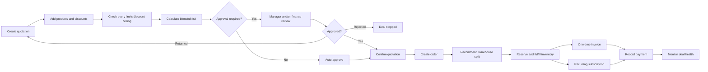
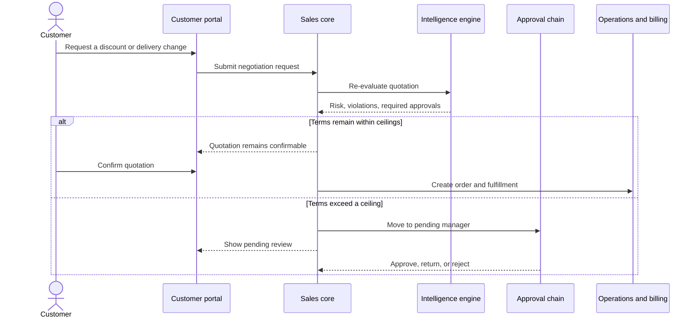
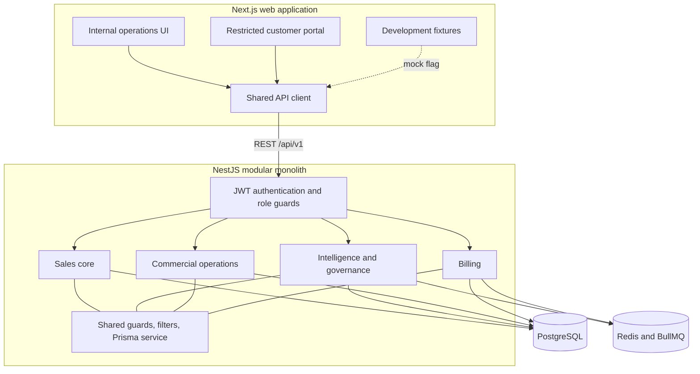
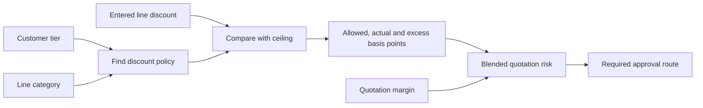
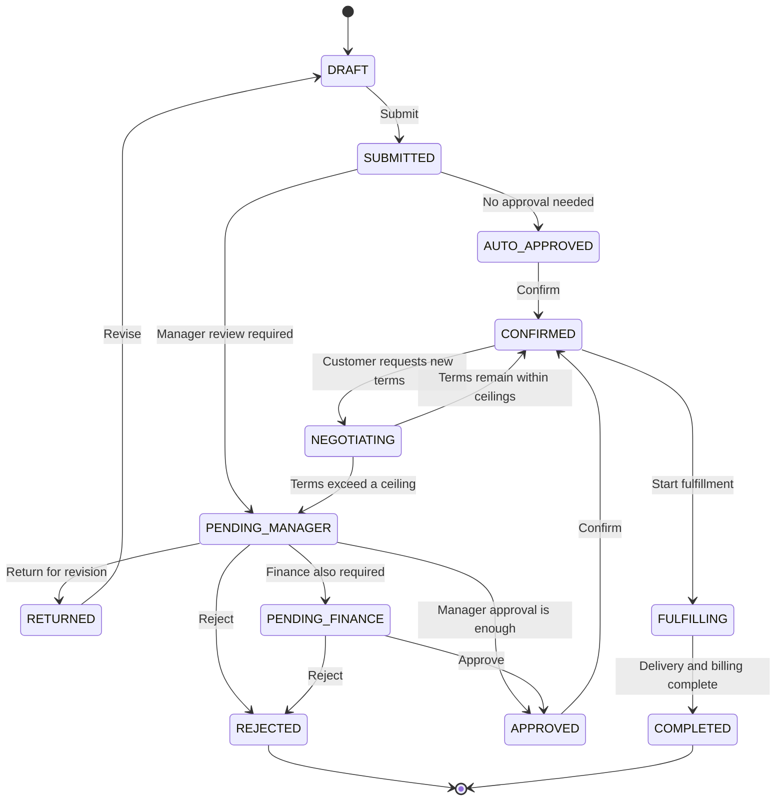
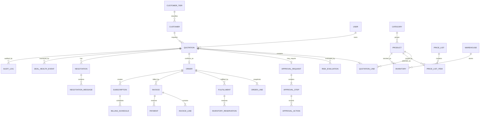
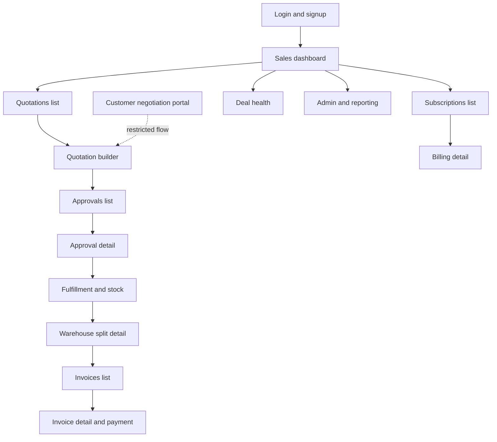
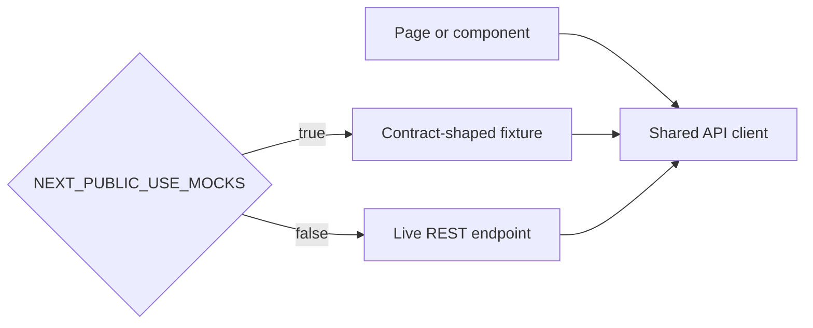

# DealFlow360

DealFlow360 is a B2B sales-operations platform that carries a deal through one governed workflow: quotation, discount validation, approval, order creation, warehouse allocation, fulfillment, invoicing, subscriptions, payment, and deal-health monitoring.

The goal is not simply to display attractive screens. The complete workflow must run with real, deterministic application logic. The frontend explains the results, while the backend owns every business decision.

> **Project status:** This README describes the agreed product behavior and target architecture. Keep it aligned with the frozen project plan as implementation progresses.

## Contents

- [Product overview](#product-overview)
- [Example deal journey](#example-deal-journey)
- [Architecture](#architecture)
- [Technology stack](#technology-stack)
- [Engineering ownership](#engineering-ownership)
- [Core business rules](#core-business-rules)
- [Quotation state machine](#quotation-state-machine)
- [Data model](#data-model)
- [Pages and navigation](#pages-and-navigation)
- [Customer portal](#customer-portal)
- [API contract](#api-contract)
- [Mock-first frontend development](#mock-first-frontend-development)
- [Local development](#local-development)
- [Team workflow](#team-workflow)
- [Definition of done](#definition-of-done)
- [Limitations and future work](#limitations-and-future-work)

## Product overview

A salesperson creates a quotation and adds products, quantities, and discounts. Each line is checked against the discount ceiling for its product category and the customer's tier. The line results are blended into a risk evaluation that decides which approvals are required.

After confirmation, the quotation becomes an order. The platform recommends a warehouse split, reserves inventory, tracks fulfillment, separates one-time and recurring billing, records payment, and watches the deal for delays or anomalies.



## Example deal journey

Imagine that Acme Corp requests two laptops, an onsite setup service, and an extended warranty.

1. A sales representative creates quotation `Q-1042`.
2. The laptop discount is 12% against a 15% ceiling, so that line is valid.
3. The setup-service discount is 18% against a 10% ceiling, so the UI displays `OVER (+8 pt)`.
4. The backend evaluates all lines and returns a high blended risk score.
5. The quote goes to the sales manager and then finance.
6. Every approval, rejection, return, edit, and transition is added to the audit log.
7. After approval, the quote is confirmed and copied into an order.
8. The system recommends a stock split between Main Warehouse and East Depot.
9. Shipped one-time products are invoiced; the care plan becomes a subscription.
10. Payment is recorded, and Deal Health watches for anomalies or delays.

The customer can also request different terms through a restricted portal. If a negotiated discount crosses a configured ceiling, the quote automatically re-enters approval.



## Architecture

DealFlow360 is a modular monolith: one backend application, one database, and clear module boundaries. This avoids the deployment and debugging cost of microservices while preserving strong ownership.



## Technology stack

| Area | Technology |
|---|---|
| Frontend | Next.js, TypeScript, Tailwind CSS, shadcn/ui, TanStack Query |
| Backend | NestJS, TypeScript, REST |
| Validation | Zod and `class-validator` |
| Database | PostgreSQL with Prisma multi-file schemas |
| Background work | Redis and BullMQ |
| Authentication | JWT access tokens, refresh tokens, role guards |
| Testing | Jest, Supertest, Playwright |
| Local infrastructure | Docker Compose |

The project intentionally uses one ORM, one frontend query approach, one UI kit, and one backend deployment. A new runtime dependency requires agreement from all owners.

## Repository structure

```text
apps/
  api/
    src/modules/
      sales/             # B1
      intelligence/      # B2
      operations/        # B3
      billing/           # B3
      shared/            # Group-owned infrastructure
  web/                   # F
packages/
  contracts/             # Shared DTOs, enums and error codes
prisma/
  schema/                # One schema file per domain
  seed/
    index.ts
    base.seed.ts
    catalog.seed.ts
    policy.seed.ts
    demo.seed.ts
docker-compose.yml
plan.md
explain.md
```

## Engineering ownership

| Owner | Responsibility | Owned paths |
|---|---|---|
| **F — Frontend** | Fifteen screens, internal shell, portal shell, API client | `apps/web/**` |
| **B1 — Sales core** | Authentication, customers, quotations, lines, totals, orders, state machine | Sales module and `sales.prisma` |
| **B2 — Intelligence** | Discount rules, risk, approvals, audit, upsells, allocation choice, deal health | Intelligence module and `intelligence.prisma` |
| **B3 — Operations** | Catalog, pricing, tax, inventory, warehouses, fulfillment, subscriptions, invoices, payments, negotiations | Operations and billing modules and schemas |

An owner does not edit another owner's paths. Cross-team changes are requested from the relevant owner.

Database ownership follows the same rule:

- **B1:** users, roles, customers, tiers, quotations, quotation lines, orders, order lines.
- **B2:** policies, risk evaluations, approvals, approval actions, audit logs, inventory reservations, deal-health events.
- **B3:** catalog, products, variants, prices, tax, warehouses, inventory, movements, fulfillments, subscriptions, invoices, payments, negotiations.

## Core business rules

These are invariants. Breaking one is a defect even if a test happens to pass.

### Money and percentages

Money is an integer number of minor units plus a three-character currency code. Floating-point money is never used.

```json
{
  "amountMinor": 125000,
  "currency": "INR"
}
```

Percentages use basis points, so 18% is stored as `1800`.

### Business decisions belong to the backend

The browser may format data, sort rows, and validate input shape. It must not decide approval requirements, risk, warehouse allocation, tax, totals, or billing eligibility. Those answers arrive from backend response fields.

### Discounts are evaluated per line

Each quotation line is checked against the ceiling for its category and customer tier. The results are then blended across the quotation. A valid hardware discount cannot hide an excessive services discount.



### One entity, one owner

Each entity has one owning module and one Prisma model. Cross-domain modules store foreign IDs rather than duplicating a model.

### One writer for quotation status

Only `quote-state.service.ts` changes `quotations.status`. Unsupported transitions return `QUOTE_INVALID_STATE`.

### Transactional audit trail

Every state transition, approval action, discount override, and negotiation response writes an append-only audit row in the same transaction as the change.

### Server-enforced portal security

A customer-role user can access only that customer's records. Every portal handler obtains `customerId` from the authenticated token and filters on the server. Hiding data in the UI is not a security boundary.

### Data-driven thresholds

Discount and approval thresholds live in `discount_policies`. Values that decide outcomes are never hard-coded in application logic.

## Quotation state machine



Related lifecycles:

- **Inventory:** `AVAILABLE → RESERVED → ALLOCATED → SHIPPED`; cancellation uses `RELEASED`.
- **Fulfillment:** `ORDER_CONFIRMED → INVENTORY_RESERVED → PICKING → PACKED → SHIPPED → DELIVERED`, with `BACKORDERED` when stock cannot cover demand.
- **Invoice:** `DRAFT → ISSUED → PARTIALLY_PAID → PAID`, plus `VOID` and `OVERDUE`.
- **Subscription:** `ACTIVE`, `PAUSED`, or `CANCELLED`.

Stock is not silently decremented. Reservations and inventory movements explain what happened.

## Data model



Important details:

- IDs are `cuid()` strings.
- Every table has `createdAt` and `updatedAt`.
- Risk evaluations are append-only so negotiation history remains visible.
- Inventory stores `onHand` and `reserved`; `available` is derived.
- Order lines copy quotation-line values at confirmation because the quote may change later.

## Pages and navigation

The internal navigation is:

`Dashboard · Quotations · Approvals · Fulfillment · Subscriptions · Invoices · Deal Health · Reports`

List pages show all records of an entity. Clicking a row opens that record's detail page.



| # | Page | Route | Purpose |
|---:|---|---|---|
| 1 | Login and signup | `/login`, `/signup` | Authenticate internal users and customers |
| 2 | Sales dashboard | `/dashboard` | Show approvals, open quotes, risk, and recent activity |
| 3 | Quotations list | `/quotations` | Search and filter all quotations |
| 4 | Quotation builder | `/quotations/[id]` | Edit lines, display returned discount status, review upsells, submit |
| 5 | Approvals list | `/approvals` | Review the approval work queue |
| 6 | Approval detail | `/approvals/[id]` | Explain violations, risk, decisions, and audit history |
| 7 | Fulfillment and stock | `/fulfillment` | View inventory and orders awaiting fulfillment |
| 8 | Warehouse split detail | `/fulfillment/[orderId]` | Accept or override the suggested allocation |
| 9 | Subscriptions list | `/subscriptions` | View recurring plans |
| 10 | Billing detail | `/subscriptions/[id]` | Review recurring charges and subscription controls |
| 11 | Customer portal | `/portal/quotations/[token]` | Let a customer review, negotiate, and confirm safely |
| 12 | Invoices list | `/invoices` | Search one-time and recurring invoices |
| 13 | Invoice detail and payment | `/invoices/[id]` | Reconcile delivery, invoice lines, and payments |
| 14 | Deal health | `/deal-health` | Show stalled deals, discount anomalies, and delivery risk |
| 15 | Admin and reporting | `/admin/reports` | Show trends, bottlenecks, and platform usage |

Important UI behavior:

- Screen 4 displays `OVER` while a discount is being entered, using backend evaluation data.
- Screen 6 explains the exact lines that crossed their ceilings and the number of points over.
- Screen 8 shows warehouse allocations, shipping count, cost, and backorders.
- Screen 11 uses a separate portal shell and navigation.
- Screen 13 keeps partial billing reconciled with partial shipment. Nothing is invoiced before it ships.
- Every page includes loading, empty, and error states.

The product-flow design also includes catalog, variants, price lists, tax, subscription cadence, and tier/category discount ceilings. To keep the agreed route count stable, this begins as an Admin/Reports configuration subview rather than a sixteenth top-level module.

## Customer portal

The portal is a separate product surface, not the internal application with hidden menu items. Its navigation is limited to:

- **My Quotation**
- **Messages**
- **Profile**

Portal responses never include internal risk scores, risk levels, approval notes, cost, margin, or another customer's data.

A confirmation returns either:

```json
{ "outcome": "CONFIRMED", "orderId": "order_123" }
```

or:

```json
{ "outcome": "APPROVAL_REQUIRED", "status": "PENDING_MANAGER" }
```

For the second result, the customer sees a simple pending-review message, not internal reasoning.

## API contract

The REST base path is `/api/v1`. Everything except login, signup, and token refresh requires a bearer JWT.

Success:

```json
{
  "success": true,
  "data": {}
}
```

Lists place records in `data.items` and also return `total`, `page`, and `pageSize`.

Failure:

```json
{
  "success": false,
  "error": {
    "code": "DISCOUNT_LIMIT_EXCEEDED",
    "message": "Discount exceeds the configured category limit.",
    "details": {
      "quoteLineId": "line_2",
      "allowedBps": 1000,
      "actualBps": 1800
    }
  }
}
```

| Code | HTTP | Meaning |
|---|---:|---|
| `VALIDATION_FAILED` | 400 | Input failed validation |
| `UNAUTHENTICATED` | 401 | Authentication is missing or invalid |
| `FORBIDDEN` | 403 | The user lacks permission |
| `PORTAL_SCOPE_VIOLATION` | 403 | A portal user requested another customer's data |
| `NOT_FOUND` | 404 | The record does not exist |
| `QUOTE_INVALID_STATE` | 409 | The quotation transition is not allowed |
| `DISCOUNT_LIMIT_EXCEEDED` | 409 | A discount crossed a ceiling |
| `APPROVAL_STEP_NOT_YOURS` | 409 | The user cannot act on this approval step |
| `INSUFFICIENT_STOCK` | 409 | Inventory cannot cover the request |
| `INVOICE_BEFORE_SHIPMENT` | 409 | Billing was attempted before shipment |
| `SUBSCRIPTION_INVALID_STATE` | 409 | The subscription transition is invalid |

API areas are divided into sales core, intelligence, operations/billing, and the customer portal. Renaming an error or changing a published response shape requires agreement from all owners.

## Mock-first frontend development

The frontend consumes three backend domains, so it is built against contract-shaped fixtures before every live endpoint exists.

Fixtures live in:

```text
apps/web/src/mocks/
```

The API client uses one flag:

```ts
const USE_MOCKS = process.env.NEXT_PUBLIC_USE_MOCKS === "true";
```



Switching to live data should mean removing one API-client branch, not rewriting a component. If a screen cannot be demonstrated with fixtures, the contract probably needs more information.

## UI design principles

- Build reusable tables, filters, forms, badges, timelines, dialogs, and summary panels.
- Keep the visual hierarchy clear, restrained, and suitable for daily B2B work.
- Use neutral surfaces, readable typography, thin borders, and semantic status colors.
- Avoid decorative gradients, glass effects, oversized headings, excessive floating cards, and generic AI-dashboard decoration.
- Keep the internal application and customer portal visibly separate.
- Make text, forms, tables, and components editable rather than embedding them in images.

Google Stitch may be used to establish layouts and a shared visual language. Stitch MCP is useful after initial designs exist because a coding agent can then read the screens and design system. It is a design-to-code aid, not part of the DealFlow360 runtime.

## Local development

Once the repository is scaffolded, the expected setup is:

1. Install Node.js and `pnpm`.
2. Copy `.env.example` to a local environment file and enter the required values.
3. Start PostgreSQL and Redis using Docker Compose.
4. Install workspace dependencies.
5. Apply Prisma migrations.
6. Seed the database so the entire demo flow works without manual setup.
7. Start the NestJS API and Next.js web application.

Typical commands may look like:

```bash
pnpm install
docker compose up -d
pnpm prisma migrate dev
pnpm prisma db seed
pnpm dev
```

Confirm the exact script names in the root `package.json` before running them.

## Team workflow

Branches use an owner prefix:

```text
main
f/<feature>
b1/<feature>
b2/<feature>
b3/<feature>
```

Integration rules:

1. `main` must always start and seed successfully.
2. Rebase on `main` before opening a pull request and again before merging.
3. Do not edit another owner's paths.
4. Never edit or delete an applied migration; add a new migration.
5. Name migrations `<owner>_<what>`, such as `b2_approval_steps`.
6. Announce before multiple people generate Prisma migrations at the same time.
7. Integrate at the planned two-hour checkpoints instead of holding long-lived branches.
8. Do not add assistant co-author or attribution trailers to commits.

All four owners must agree before changing a shared enum, published response shape, HTTP status, runtime dependency, shared API infrastructure, contracts, Docker configuration, environment template, authentication middleware, or portal access boundary.

## Definition of done

A feature is complete only when every relevant item is true:

- its migration is written and applied;
- DTO and input validation are implemented;
- server-side authorization is checked;
- the endpoint matches the shared contract;
- the frontend has loading, empty, and error states;
- calculations have unit tests;
- seed data demonstrates the feature without manual database work;
- `pnpm typecheck`, `pnpm lint`, and `pnpm test` pass;
- the browser console is clean.

## Limitations and future work

The first version intentionally keeps some areas simple:

- payments are simulated rather than settled through a real gateway;
- subscriptions are billed without proration;
- upsell ranking uses deterministic rules and seeded product relationships;
- the money model supports currency codes, but full multi-currency pricing is not implemented.

Possible next steps include mid-cycle proration, real gateway settlement, credit notes, learned upsell ranking, approval delegation, out-of-office routing, full multi-currency price lists, and a dedicated product/pricing administration module.

## Guiding principle

The most important quality of DealFlow360 is that the whole chain is real and traceable. A plain screen backed by correct rules, permissions, transactions, audit history, and state transitions is more valuable than a polished screen that only imitates the workflow.

